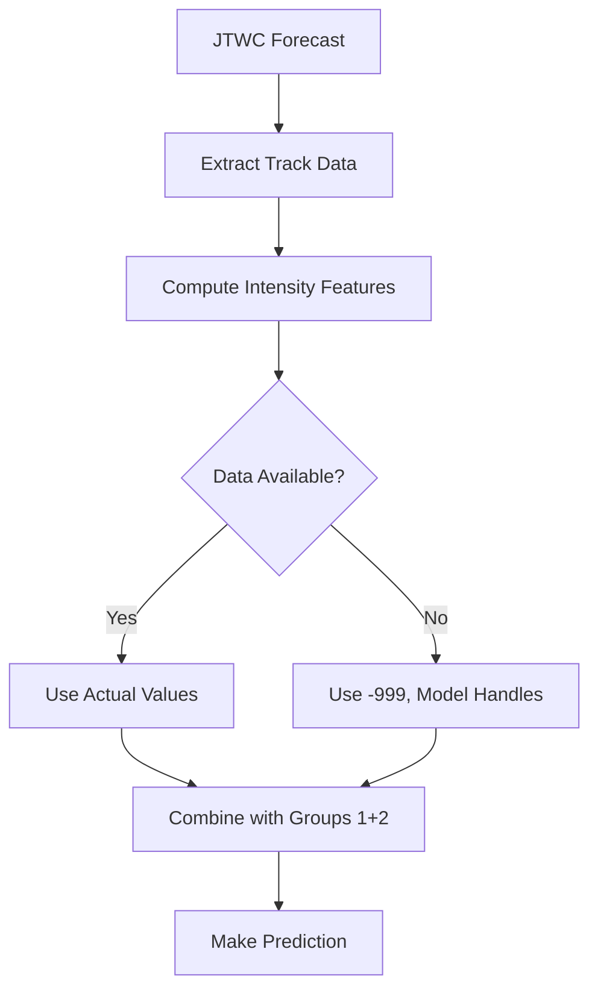

# Storm Intensity Feature Engineering Pipeline

## Overview

This pipeline processes JTWC storm track data to generate **7 GROUP 3 features** for machine learning models predicting storm impacts. These features capture storm strength characteristics at critical moments and how intensity evolves over time.

**⚠️ CRITICAL NOTE:** These features have **40-70% missing data** due to incomplete intensity observations in the JTWC dataset. The pipeline handles missing values gracefully using `-999` as a missing value indicator.

## Files Created

### 1. `group3_storm_intensity_features.py`
Main feature engineering script with modular functions for:
- ✅ Intensity at Critical Moments (4 features)
- ✅ Intensity Evolution Features (3 features)
- ✅ Robust missing data handling
- ✅ Wind standardization (1-min USA → 10-min TOKYO equivalent)

### 2. `intensity_features_group3.csv`
Pre-computed features for all historical storms (2010-2025):
- **~21,000+ records** (storm-province pairs)
- **114+ storms** across **16 years**
- **82 provinces**
- **7 features** per record
- **40-70% missing data** (handled with `-999`)

### 3. `example_deployment_usage.py`
Usage examples demonstrating:
- Real-time intensity feature extraction
- Single storm processing
- Data completeness analysis
- Combining with other feature groups
- Missing data handling strategies for ML

---

## 📊 The 7 Features

### Group 3.1: Intensity at Critical Moments (4 features)
| Feature | Description | Units | Source | Completeness |
|---------|-------------|-------|--------|--------------|
| `wind_at_closest_approach_kt` | Wind speed when nearest province | knots (10-min) | TOKYO_WIND or USA_WIND × 0.88 | ~60-70% |
| `max_wind_in_track_kt` | Peak intensity during event | knots | max(TOKYO_WIND) or max(USA_WIND) | ~60-70% |
| `pressure_at_closest_hpa` | Pressure at closest approach | hPa | TOKYO_PRES | ~55% |
| `min_pressure_in_track_hpa` | Minimum pressure (strongest point) | hPa | min(TOKYO_PRES) | ~55% |

**Note:** Wind values are standardized to 10-minute sustained winds. USA 1-minute winds are converted using factor 0.88.

### Group 3.2: Intensity Evolution Features (3 features)
| Feature | Description | Values | Completeness |
|---------|-------------|--------|--------------|
| `is_intensifying` | Is storm strengthening toward closest approach? | 0 or 1 (boolean) | ~50% |
| `wind_change_approaching_kt` | Wind speed change during approach | knots (can be negative) | ~50% |
| `intensification_rate_kt_per_day` | Rate of intensification | knots/day | ~50% |

---

## 🚀 Quick Start

### Process All Historical Storm Data
```python
from group3_storm_intensity_features import process_all_storm_intensity_data

# Generate features for all storms
features_df = process_all_storm_intensity_data(
    storm_data_file='Storm_data/ph_storm_data.csv',
    output_file='Feature_Engineering_Data/group3/intensity_features_group3.csv',
    distance_features_file='Feature_Engineering_Data/group1/distance_features_group1.csv',
    province_list_file='Location_data/locations_latlng.csv'
)
```

### Process Single Storm
```python
from group3_storm_intensity_features import compute_all_intensity_features
import pandas as pd

# Load storm data
storm_data = pd.read_csv('Storm_data/ph_storm_data.csv')
storm_track = storm_data[
    (storm_data['SEASON'] == 2021) &
    (storm_data['PHNAME'] == 'Odette')
]

# Compute features
features = compute_all_intensity_features(
    storm_track,
    province='Cebu',
    distance_features_df=None
)
```

### Deployment: Real-time Feature Extraction
```python
from group3_storm_intensity_features import extract_intensity_features_for_deployment
import pandas as pd

# From live JTWC data
track_data = pd.DataFrame({
    'TOKYO_WIND': [25, 35, 45, 55, 65, 70, 65, 55],
    'USA_WIND': ['', '', '', '', '', '', '', ''],
    'TOKYO_PRES': [1005, 1002, 998, 994, 990, 988, 992, 996],
    'PH_DAY': ['2024-11-15'] * 8,
    'PH_TIME': ['00:00', '03:00', '06:00', '09:00', '12:00', '15:00', '18:00', '21:00']
})

features = extract_intensity_features_for_deployment(
    track_data=track_data,
    closest_approach_idx=5  # 15:00 is closest
)
```

---

## 📈 Data Quality & Completeness

### Expected Completeness by Feature
```
wind_at_closest_approach_kt      : 60-70% complete
max_wind_in_track_kt             : 60-70% complete
pressure_at_closest_hpa          : 55% complete
min_pressure_in_track_hpa        : 55% complete
is_intensifying                  : 50% complete
wind_change_approaching_kt       : 50% complete
intensification_rate_kt_per_day  : 50% complete
```

### Why So Much Missing Data?

1. **Early/Weak Storms:** Weak tropical depressions often lack intensity estimates
2. **Remote Areas:** Storms far from observation networks have sparse data
3. **Historical Limitations:** Older storms (2010-2015) have less complete records
4. **Satellite Gaps:** Intensity estimation requires satellite data, not always available

### Impact on ML Models

**Tree-based models (XGBoost, Random Forest):**
- ✅ Can handle `-999` natively as a category
- ✅ Will learn "missing intensity data" as a feature itself
- ✅ Recommended approach: Keep `-999` as-is

**Linear models (Logistic Regression, SVM):**
- ⚠️ Require imputation or indicator variables
- Strategy 1: Create binary "data_available" features
- Strategy 2: Impute with median/mean
- Strategy 3: Use multiple imputation

**Neural Networks:**
- ⚠️ Require normalization and imputation
- Use embedding layers for missing value indicators
- Consider separate pathway for complete vs. incomplete data

---

## 🔧 Function Reference

### Core Functions

#### `compute_all_intensity_features(storm_track_df, province, distance_features_df=None)`
Compute all 7 features for a single storm-province pair.

**Args:**
- `storm_track_df`: DataFrame with storm track data
- `province`: Province name
- `distance_features_df`: Optional distance features for closest approach

**Returns:** Dictionary with all 7 features

#### `process_all_storm_intensity_data(storm_data_file, output_file, distance_features_file, province_list_file)`
Batch process all storms.

**Args:**
- `storm_data_file`: Path to JTWC storm data CSV
- `output_file`: Output CSV filename
- `distance_features_file`: Path to distance features (optional)
- `province_list_file`: Path to province list (optional)

**Returns:** DataFrame with all features

#### `extract_intensity_features_for_deployment(track_data, closest_approach_idx=None)`
Streamlined function for real-time deployment.

**Args:**
- `track_data`: DataFrame with TOKYO_WIND, USA_WIND, TOKYO_PRES, etc.
- `closest_approach_idx`: Index of closest approach (defaults to middle)

**Returns:** Dictionary with all 7 features

---

## 📁 Input Data Format

### Expected CSV Structure (`Storm_data/ph_storm_data.csv`)
```csv
SID,SEASON,PHNAME,NAME,LAT,LON,PH_DAY,PH_TIME,STORM_SPEED,STORM_DIR,TOKYO_WIND,TOKYO_PRES,USA_WIND
2010078N03153,2010,Agaton,OMAIS,3.2,153.3,2010-03-19,14:00:00,12,240, , ,15
2010078N03153,2010,Agaton,OMAIS,2.9,152.8,2010-03-19,17:00:00,12,245, , ,15
...
```

**Note:** Spaces in TOKYO_WIND and TOKYO_PRES indicate missing values.

### Output Format (`intensity_features_group3.csv`)
```csv
Year,Storm,Province,is_intensifying,intensification_rate_kt_per_day,...
2010,Agaton,Abra,1.0,2.5,...
2010,Agaton,Agusan del Norte,-999,-999,...
...
```

**Note:** `-999` indicates missing data.

---

## 🎯 Use Cases

### 1. Training ML Models with Missing Data Handling
```python
import pandas as pd
import numpy as np
from sklearn.ensemble import RandomForestClassifier

# Load features
intensity_features = pd.read_csv('Feature_Engineering_Data/group3/intensity_features_group3.csv')

# Approach 1: Use as-is with tree-based models
X = intensity_features.drop(['Year', 'Storm', 'Province'], axis=1)
# XGBoost/RandomForest will treat -999 as a distinct value

# Approach 2: Create indicator features
for col in X.columns:
    X[f'{col}_available'] = (X[col] != -999).astype(int)
    X[col] = X[col].replace(-999, np.nan)
```

### 2. Combining with Complete Feature Groups
```python
# Load all feature groups
distance_df = pd.read_csv('Feature_Engineering_Data/group1/distance_features_group1.csv')
weather_df = pd.read_csv('Feature_Engineering_Data/group2/weather_features_group2.csv')
intensity_df = pd.read_csv('Feature_Engineering_Data/group3/intensity_features_group3.csv')

# Merge all
combined_df = distance_df.merge(weather_df, on=['Year', 'Storm', 'Province']) \
                         .merge(intensity_df, on=['Year', 'Storm', 'Province'])

# Now you have:
# - 26 distance features (100% complete)
# - 20 weather features (100% complete)  ← Most important!
# - 7 intensity features (40-70% complete)  ← Bonus when available
```

### 3. Feature Importance Analysis
```python
# Which intensity features are most predictive (when available)?
import xgboost as xgb

# Filter to records with complete intensity data
complete_data = combined_df[combined_df['max_wind_in_track_kt'] != -999]

# Train model
model = xgb.XGBClassifier()
model.fit(complete_data[feature_cols], complete_data['impact_label'])

# Feature importance
importance = pd.DataFrame({
    'feature': feature_cols,
    'importance': model.feature_importances_
}).sort_values('importance', ascending=False)
```

---

## ⚡ Performance

- **Processing Speed**: ~2-3 seconds per storm
- **Total Processing Time**: ~4-6 minutes for all 114 storms
- **Output Size**: ~2 MB CSV file
- **Memory Usage**: < 300 MB

---

## 🔗 Integration with Other Feature Groups

### Priority Ranking
1. **GROUP 2 (Weather)**: 100% complete, most reliable ⭐⭐⭐
2. **GROUP 1 (Distance)**: 100% complete, spatial context ⭐⭐⭐
3. **GROUP 3 (Intensity)**: 40-70% complete, bonus when available ⭐

### Recommendation
**Always use GROUP 1 + GROUP 2 as baseline.**  
Add GROUP 3 as supplementary features that improve predictions when available.

---

## 🔮 Future Enhancements

- [ ] Integrate satellite-derived intensity estimates (CIRA, CIMSS)
- [ ] Add wind radii features (R34, R50, R64)
- [ ] Include storm size metrics (eye diameter, CDO characteristics)
- [ ] Implement advanced imputation (MICE, KNN)
- [ ] Add uncertainty estimates for imputed values
- [ ] Include asymmetric wind structure features

---

## 📝 Technical Notes

### Wind Standardization
- **TOKYO_WIND**: 10-minute sustained winds (JMA standard)
- **USA_WIND**: 1-minute sustained winds (JTWC standard)
- **Conversion Factor**: 0.88 (USA → TOKYO equivalent)

### Missing Value Handling
- **Indicator**: `-999` (not `NaN`) for easier tracking
- **Rationale**: Allows models to distinguish "missing" from "zero"
- **ML Consideration**: Tree models benefit from explicit missing indicators

### Pressure Values
- **Range**: 900-1010 hPa typically
- **Interpretation**: Lower = stronger storm
- **Missing**: More common than wind (fewer pressure observations)

---

## 🤝 Deployment Workflow



**Key Point:** Missing intensity data is OK! Models trained on historical data already learned how to handle it.

---

**Author:** Feature Engineering Pipeline  
**Version:** 1.0  
**Last Updated:** 2024  
**License:** MIT  
**Data Source:** JTWC Best Track Data


